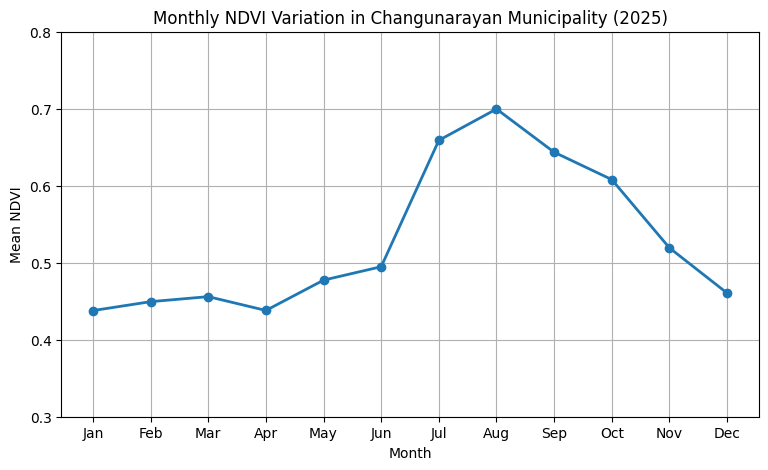
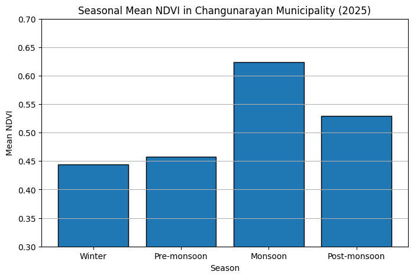
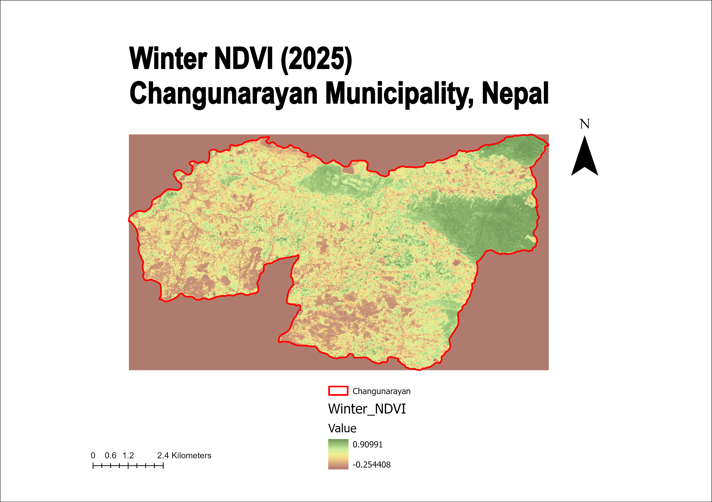
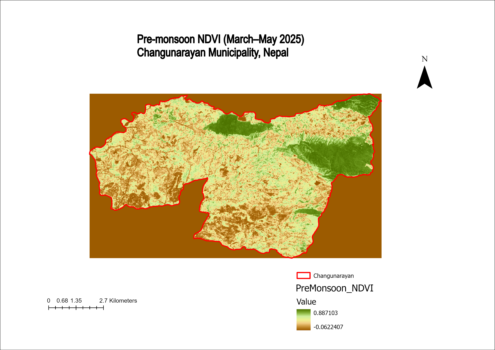
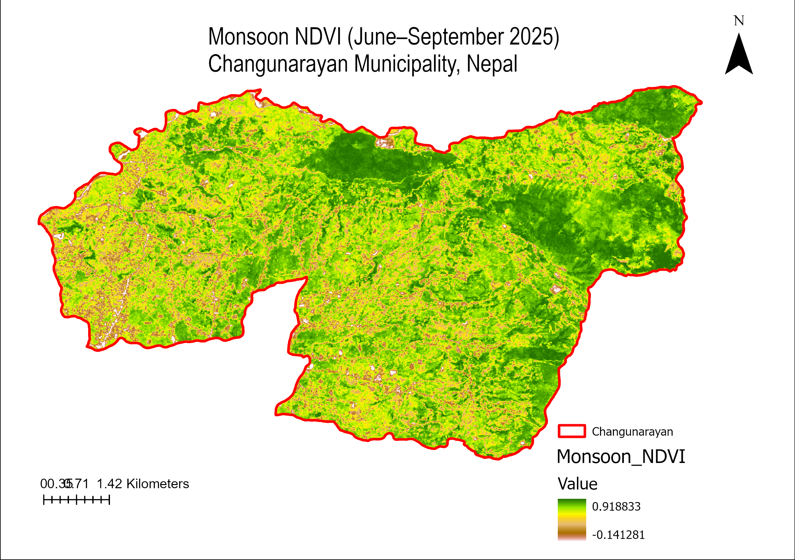
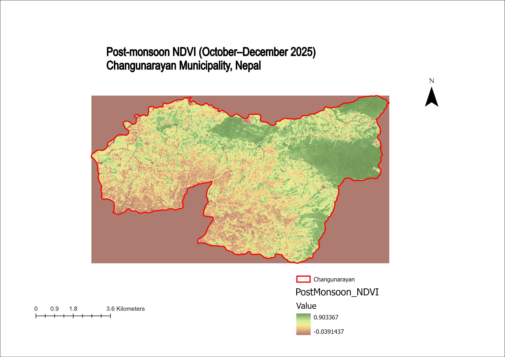

# Seasonal NDVI Analysis of Changunarayan Municipality Using Sentinel-2 Imagery

Seasonal vegetation analysis of Changunarayan Municipality, Bhaktapur District, Nepal, using Sentinel-2 satellite imagery, Google Earth Engine, ArcGIS Pro, and Python.

---

# Project Overview

This project evaluates seasonal vegetation dynamics in Changunarayan Municipality using the Normalized Difference Vegetation Index (NDVI) derived from Sentinel-2 satellite imagery. Google Earth Engine was used for satellite image processing and cloud masking, ArcGIS Pro for producing publication-quality maps, and Python for data visualization and statistical analysis.

---

# Objectives

- Calculate monthly NDVI values for the year 2025.
- Generate seasonal NDVI composites.
- Compare vegetation conditions among Winter, Pre-monsoon, Monsoon, and Post-monsoon seasons.
- Produce publication-quality maps and graphical visualizations.
- Demonstrate a reproducible remote sensing workflow using Google Earth Engine, ArcGIS Pro, and Python.

---

# Study Area

**Location:** Changunarayan Municipality, Bhaktapur District, Nepal

---

# Data Source

- Sentinel-2 Surface Reflectance Harmonized (COPERNICUS/S2_SR_HARMONIZED)
- Spatial Resolution: 10 meters
- Study Period: January–December 2025

---

# Software and Tools

- Google Earth Engine
- ArcGIS Pro
- Python
- Google Colab

---

# Methodology

1. Imported the Changunarayan municipal boundary into Google Earth Engine.
2. Applied Scene Classification Layer (SCL) masking to reduce cloud contamination.
3. Calculated monthly NDVI from Sentinel-2 imagery.
4. Generated seasonal NDVI composites:
   - Winter (January–February)
   - Pre-monsoon (March–May)
   - Monsoon (June–September)
   - Post-monsoon (October–December)
5. Exported seasonal NDVI rasters.
6. Created publication-quality maps in ArcGIS Pro.
7. Produced NDVI trend and seasonal comparison charts using Python.

---

# Results

## Seasonal Mean NDVI

| Season | Mean NDVI |
|---------|----------:|
| Winter | 0.4436 |
| Pre-monsoon | 0.4571 |
| Monsoon | 0.6242 |
| Post-monsoon | 0.5293 |

The analysis revealed a clear seasonal pattern in vegetation dynamics. Mean NDVI increased from winter (0.4436) to its highest value during the monsoon season (0.6242), reflecting peak vegetation growth. NDVI decreased slightly during the post-monsoon season (0.5293), consistent with seasonal vegetation cycles in central Nepal.

---

# Project Outputs

## Monthly NDVI Trend



---

## Seasonal NDVI Comparison



---

## Winter NDVI (2025)



---

## Pre-monsoon NDVI (2025)



---

## Monsoon NDVI (2025)



---

## Post-monsoon NDVI (2025)



---

# Repository Structure

```text
Changunarayan-NDVI-Analysis/
│
├── Changunarayan_boundary/
├── Data/
│   └── Changunarayan_NDVI_2025_Final.csv
├── Figures/
│   ├── Monthly_NDVI_Trend.png.png
│   └── Seasonal_NDVI_Comparison.png.png
├── Maps/
│   ├── Winter_NDVI_2025.png.png
│   ├── PreMonsoon_NDVI_2025.png.png
│   ├── Monsoon_NDVI_2025.png.png
│   └── PostMonsoon_NDVI_2025.png.png
├── Scripts/
│   ├── EarthEngine_NDVI_Analysis.js
│   └── Changunarayan_NDVI_Analysis.ipynb
└── README.md
```

---

# Skills Demonstrated

- Remote Sensing
- Geographic Information Systems (GIS)
- Google Earth Engine
- ArcGIS Pro
- Python
- Google Colab
- NDVI Analysis
- Satellite Image Processing
- Spatial Data Visualization
- Environmental Data Analysis

---

# Author

**Nisha Karki**

B.Sc. Horticulture

### Research Interests

- Precision Agriculture
- Remote Sensing
- Geographic Information Systems (GIS)
